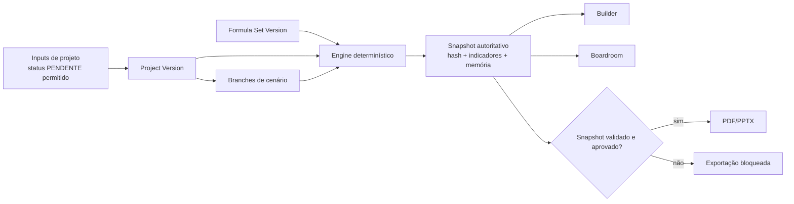

# ADR 001 — Arquitetura inicial do IGR Consulting

**Status:** Aceito para V1, com ressalva de persistência.  
**Data:** 2026-08-25.  
**Decisor:** IGR Consulting / Manus AI.

## Contexto

O blueprint recebido define PostgreSQL relacional, cálculo separado da UI, fórmula versionada, snapshots autoritativos, proveniência e baseline imutável. O ambiente gerenciado fornecido pelo scaffold contém MySQL/TiDB, Express, tRPC, React e autenticação pronta. Tratar MySQL como PostgreSQL seria uma gambiarra de terno e gravata: ambos são relacionais, mas RLS e alguns padrões de temporalidade não são equivalentes.

## Decisão

O núcleo será implementado de forma **portável e determinística**. A camada de domínio não depende do dialeto do banco. A primeira persistência usará o banco gerenciado já disponível, com autorização obrigatória nos procedimentos tRPC, tabelas de tenant/projeto, registros append-only e snapshots por hash. A migração para PostgreSQL será preparada por contratos e ADR próprio antes de qualquer alegação de RLS nativo.

| Área                    | Build                                                      | Reuse                         | Buy                             | Decisão                                          |
| ----------------------- | ---------------------------------------------------------- | ----------------------------- | ------------------------------- | ------------------------------------------------ |
| Motor financeiro        | Regras, projeção, IRR, NPV, Payback, memória e invariantes | `decimal.js`                  | —                               | Build sobre decimal.                             |
| Fórmulas e proveniência | Registry, versão, lineage, hashes e explicação             | Zod                           | —                               | Build.                                           |
| UI e API                | Páginas, routers e layout de boardroom                     | React/Vite/tRPC/shadcn        | —                               | Reuse do scaffold.                               |
| Banco inicial           | Schema, snapshots e registros                              | MySQL/TiDB já fornecido       | —                               | Reuse provisório, sem alegar RLS.                |
| Banco estrito futuro    | Migração e RLS                                             | PostgreSQL                    | Serviço gerenciado, se aprovado | Condicional a credenciais/conta externa.         |
| PPTX                    | Templates a partir de snapshot                             | PptxGenJS                     | —                               | Reuse posterior.                                 |
| PDF                     | Template de relatório e bloqueio de autoridade             | Biblioteca PDF Node a validar | —                               | Não implementar até validar runtime e qualidade. |
| Grafo visual            | Nós, relações e drill-down                                 | React Flow                    | —                               | Wave 4.                                          |

## Modelo lógico mínimo

## Contrato de determinismo

1. Entradas monetárias e taxas cruzam a fronteira da API como texto decimal; conversão de `number` é recusada no caminho autoritativo.
2. A engine recebe `FormulaSet`, `InputSnapshot`, `Horizon` e `EngineVersion`; devolve `CalculationSnapshot` serializável.
3. Todo resultado relevante inclui `formulaId`, `formulaVersion`, `inputKeys`, `dependencies`, `calculationPath` e `result`.
4. Snapshot é uma nova entidade. Nenhuma exportação usa estado de formulário não salvo, cache de tela ou cálculo parcial.
5. Baseline recebe selo de imutabilidade; as alterações passam a exigir branch ou nova versão.

## Consequências

Esta arquitetura permite desenvolver e testar o produto sem inventar infraestrutura externa. Em troca, a implementação inicial não reivindica RLS nativo de PostgreSQL. Para uma operação multi-tenant de maior risco ou exposição pública, PostgreSQL com RLS precisa ser financiado/configurado e receber uma migração auditada. Até lá, tenant enforcement acontece na API e será coberto por testes de autorização negativos.
