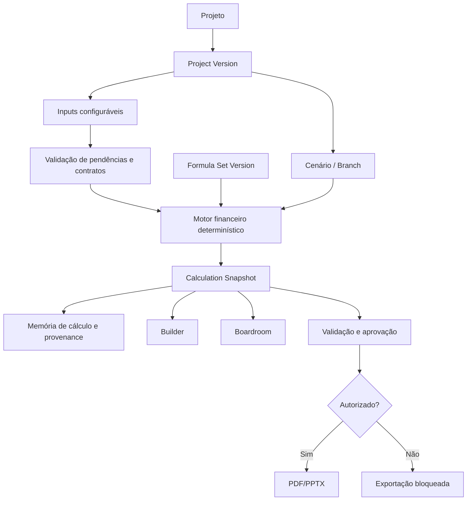

# IGR Consulting Master Blueprint — V1

## Arquitetura de produto

O IGR mantém o **domínio financeiro como fonte de verdade**. A interface não calcula KPIs relevantes por conta própria; ela coleta inputs validados, solicita uma execução do motor e exibe o snapshot retornado. O Boardroom não é um segundo produto: é uma leitura executiva do mesmo `CalculationSnapshot` produzido a partir da mesma `ProjectVersion` e `FormulaSetVersion`.

## Módulos e contratos

| Módulo           | Entrada                                  | Saída                                             | Regra de governança                                 |
| ---------------- | ---------------------------------------- | ------------------------------------------------- | --------------------------------------------------- |
| Project Registry | Identidade do projeto e tenant           | Projeto e estado atual                            | Cada acesso é escopado ao tenant.                   |
| Project Version  | Versão pai e mudanças de input           | Versão imutável ou editável por estado            | Baseline não aceita mutação.                        |
| Formula Registry | Fórmula, versão, status e autor          | `FormulaSetVersion` ativo                         | Só administrador técnico publica fórmula.           |
| Builder          | Inputs por domínio, inclusive `PENDENTE` | Input snapshot validado ou com lacunas declaradas | Não preenche dados ausentes.                        |
| Financial Engine | Formula set, input snapshot e horizonte  | KPIs, timeline e memória                          | Proibido usar `number` no cálculo autoritativo.     |
| Scenario Engine  | Baseline ou versão pai e deltas          | Branch e comparação                               | Todo branch conserva origem e deltas.               |
| Goal Seek        | KPI-meta, variável permitida e bounds    | Resultado, iterações e erro residual              | Só opera sobre variáveis explicitamente permitidas. |
| Approval         | Snapshot e decisão do comitê             | Estado aprovado/reprovado                         | Aprovação vincula versão de fórmula e hash.         |
| Export           | Snapshot aprovado e template             | Artefato e metadados                              | Falha se snapshot não for autoritativo.             |

## Modelo de dados conceitual

| Entidade              | Campos indispensáveis                                                                                       |
| --------------------- | ----------------------------------------------------------------------------------------------------------- |
| `Project`             | `id`, `tenantId`, `name`, `status`, `createdBy`, timestamps.                                                |
| `ProjectVersion`      | `id`, `projectId`, `parentVersionId`, `kind`, `state`, `inputHash`, timestamps.                             |
| `FormulaSetVersion`   | `id`, `semanticVersion`, `status`, `engineVersion`, `publishedBy`, `publishedAt`.                           |
| `InputValue`          | `versionId`, `key`, `valueText`, `status`, `sourceType`, `sourceRef`, `updatedBy`.                          |
| `CalculationSnapshot` | `id`, `versionId`, `formulaSetVersionId`, `horizonMonths`, `inputHash`, `snapshotHash`, `validationStatus`. |
| `KpiMemory`           | `snapshotId`, `kpiKey`, `valueText`, `formulaRef`, `dependencyKeys`, `explanation`.                         |
| `ScenarioBranch`      | `id`, `projectId`, `baseVersionId`, `name`, `reason`, `createdBy`.                                          |
| `ApprovalDecision`    | `snapshotId`, `decision`, `rationale`, `decidedBy`, `decidedAt`.                                            |
| `ExportArtifact`      | `snapshotId`, `format`, `status`, `storageKey`, `createdBy`, `createdAt`.                                   |
| `AuditEvent`          | `tenantId`, `entityType`, `entityId`, `action`, `actorId`, `beforeHash`, `afterHash`, timestamp.            |

## Fluxo de estados

| Estado             | Transições permitidas | Regra                                                                            |
| ------------------ | --------------------- | -------------------------------------------------------------------------------- |
| Rascunho           | Em Análise            | Inputs podem ser editados dentro das permissões.                                 |
| Em Análise         | Rascunho, Aprovado    | A engine gera snapshot identificado; pendências impeditivas bloqueiam aprovação. |
| Aprovado           | Baseline congelado    | A aprovação se refere a um snapshot específico.                                  |
| Baseline congelado | Somente via branch    | Mutação direta é proibida e auditável.                                           |
