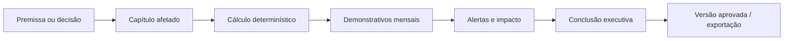

# TGR — Modelo de Produto: Estudo de Viabilidade Financeira Vivo

## Proposta única

> **O TGR é o estudo de viabilidade financeira completo, vivo e editável.**
>
> O usuário muda uma premissa; o sistema mostra imediatamente o que mudou no produto, na operação, no financeiro, no caixa e na conclusão.

O produto deve parecer um relatório executivo que ganhou vida, não uma coleção de ferramentas financeiras. O centro é o **estudo**; telas e controles existem apenas para montar, revisar, simular, defender e exportar esse estudo.

## Fluxo principal

## Três profundidades, uma fonte de verdade

| Nível            | Objetivo                              | Forma de uso                                                                              | Resultado entregue                                                                                |
| ---------------- | ------------------------------------- | ----------------------------------------------------------------------------------------- | ------------------------------------------------------------------------------------------------- |
| **Rápido**       | Descobrir se vale aprofundar.         | Um wizard com 20–25 premissas críticas.                                                   | VGV, sell-out, clientes, equipe, investimento, custo, caixa preliminar e semáforo de viabilidade. |
| **Profissional** | Montar a máquina operacional.         | Capítulos expandíveis por produto, comercial, captação, sala, pessoas, custos e carteira. | Estudo detalhado, com pendências explícitas e drivers rastreáveis.                                |
| **Completo**     | Defender uma decisão de investimento. | Projeção mensal até 120 meses, cenários, capital, riscos e aprovação.                     | Estudo financeiro autoritativo, Boardroom e exportação congelada.                                 |

O usuário deve poder começar no Rápido e aprofundar sem reintroduzir dados. Um dado fornecido no Rápido continua sendo a mesma premissa no Completo; só ganha mais contexto e granularidade.

## Navegação recomendada: capítulos de estudo

| Ordem | Capítulo              | Pergunta que responde                             |
| ----- | --------------------- | ------------------------------------------------- |
| 1     | Visão do Projeto      | O que estamos montando e em que estágio?          |
| 2     | Produto e Estoque     | O que vendemos, quanto existe e qual é o VGV?     |
| 3     | Condição Comercial    | O preço fecha e quando o dinheiro entra?          |
| 4     | Meta e Funil          | Quantas vendas, tours e casais são necessários?   |
| 5     | Canais e Captação     | De onde vêm os clientes e quanto custa trazê-los? |
| 6     | Sala e Pessoas        | A operação suporta o volume planejado?            |
| 7     | Investimento e Custos | Quanto custa implantar e manter?                  |
| 8     | Carteira e Recebíveis | O que entra, cancela, atrasa e recupera?          |
| 9     | Financeiro            | O projeto gera caixa, margem, VPL, TIR e payback? |
| 10    | Cenários e Riscos     | O que muda quando uma premissa muda?              |
| 11    | Boardroom             | Qual é a decisão e quais são seus trade-offs?     |
| 12    | Exportar              | Qual estudo aprovado será entregue?               |

## Project Operating Snapshot: a tela de 30 segundos

O primeiro painel de cada projeto deve substituir o dashboard genérico. Ele precisa apresentar, no mesmo plano visual, a operação que está sendo montada e os blocos que ainda impedem uma conclusão autoritativa.

| Faixa      | Informação essencial                                           |
| ---------- | -------------------------------------------------------------- |
| Produto    | Estoque, preço, VGV, sell-out.                                 |
| Comercial  | Meta, conversão, tours e entrada.                              |
| Captação   | Canais, casais, captadores e CAC.                              |
| Sala       | Mesas, consultores, closers e gargalo.                         |
| Pessoas    | Headcount, folha, produtividade e ramp-up.                     |
| Financeiro | CAPEX, OPEX, caixa mínimo, capital, margem e payback.          |
| Confiança  | Score de completude, pendências críticas, fórmula e data-base. |

## Interação de impacto

Toda alteração precisa abrir um resumo direto, sem lançar o usuário numa floresta de tabela:

| Componente            | Comportamento                                                               |
| --------------------- | --------------------------------------------------------------------------- |
| Alteração de premissa | Exibir antes/depois, fonte, versão e capítulos afetados.                    |
| Dependency Map        | Mostrar caminho operacional e financeiro atingido.                          |
| Cost X-Ray            | Abrir o driver de cada custo por categoria, pessoa, canal ou evento.        |
| Alerta                | Dizer o problema, o número afetado e a premissa causadora.                  |
| Cenário               | Mostrar os deltas contra baseline, não apenas um segundo conjunto de cards. |
| Boardroom             | Narrar a decisão em linguagem executiva e permitir simulação controlada.    |

## O que fica de fora da primeira versão TGR

Não incluir CRM de vendas, automação comercial, previsão com IA autônoma, “real versus planejado” ou um enxame de dashboards paralelos. A primeira versão resolve planejamento e estudo de viabilidade do início ao fim. **Primeiro o estudo que muda quando você mexe; depois a nave espacial, porra.**
